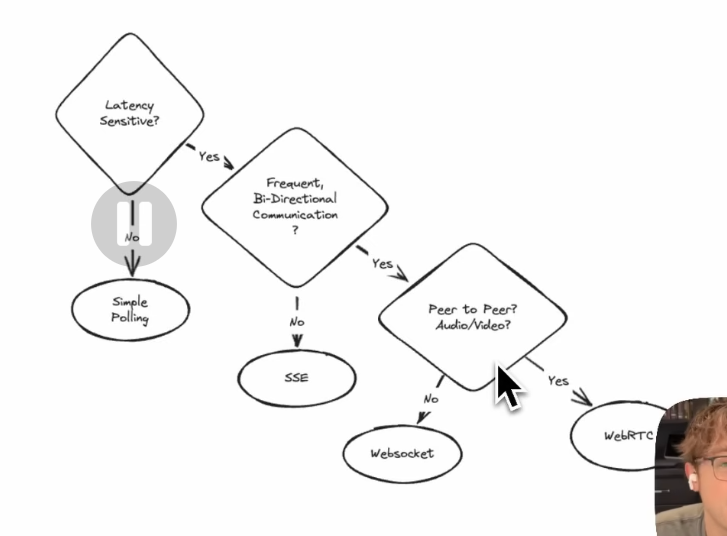

# WebSockets vs Server-Sent-Events vs Long-Polling vs WebRTC vs WebTransport

# Short Polling?

### Upside:
- Easy to implement
- Works with traditional HTTP requests

### Downside:
- It's resource-heavy. You are making frequent requests, even when no new data ios available.
- Can increase server load and netwrok traffic, which become inefficient for frequen checks like payment status updates.

=> Best for small, low-frequency data updates, such as a stock market price to update every minute or so.

# What is Long Polling?

The client repeatedly requests data from the server at regular intervals, long polling establishes a connection to the server that remains open until new data is available.

### Upside:
- Server responses when necessary

### Downside:
- Still requires reopening connection repeatedly
- Slightly more complex than short polling.

# What are Websockets?

Websockets provide a full-duplex communication channel over a single, long-lived connection between the client and server.

### Upside:
- True real-time communication with minimal latency
- Greate for bi0directional communication.

### Downside:
- More complex to implement than polling or SSE
- WebSockets  aren't always ideal for one-way communication or less frequent update, as they can consume resources by maintaining open connections
- May need firewall configuration

=> Best for applications requiring constant two-way communication, like multiplayer games, collapborative toolsm chat applications, or real-time norifications.

# What are Server-Sent-Events?

SSE provide a standard way to push server update to the client over HTTP. SSEs are designed exclusively for one-way communication from server to client, amking them ideal for scenarios like live new feeds, sports scores, stock...

### Upside:
- Ideal for on-eay data stream like new feeds, stock tickers, or payment status updates
- Lightweight and simpler to implement than WebSockets.

### Downside:
- Not suitable for bi-directional communication
- Some browsers don't fully support SSE

=> Best for real-time update where the client only needs to receive data, such as live scores, notifications, and our payment status example

# What is WebRTC?

WebRTC is an open-source project and API standard that enables real-time comminication (RTC).

It supports peer-to-peer connections for stream audio, video, and data exchange between browsers.

> ### Standard HTTP Request-Response

1. Clients Initiates: The browser sends HTTP request to the server
2. Server Processes: The server processes the request
3. Server Responds: The server sends an HTTP response back to the client
4. Connectio closes: Ttypically, the connection is closed.